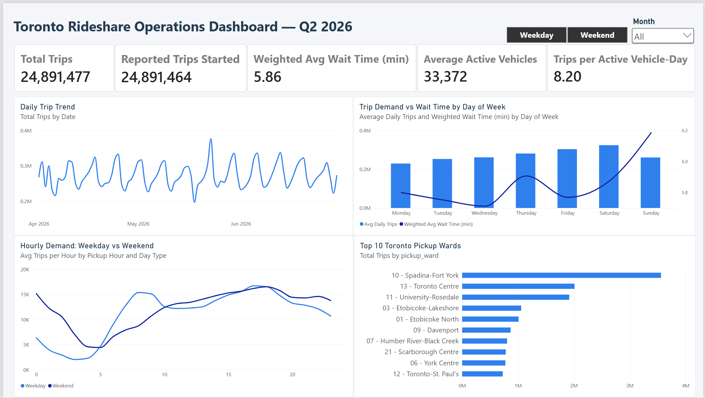
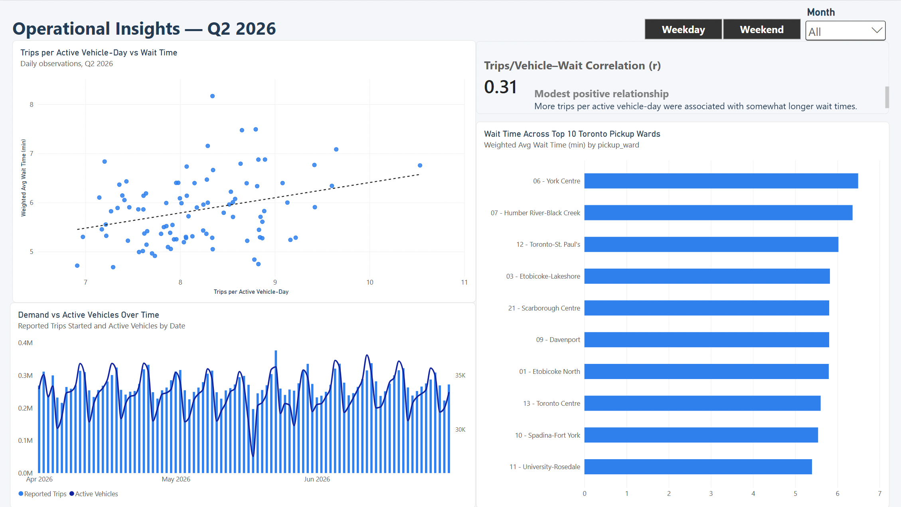
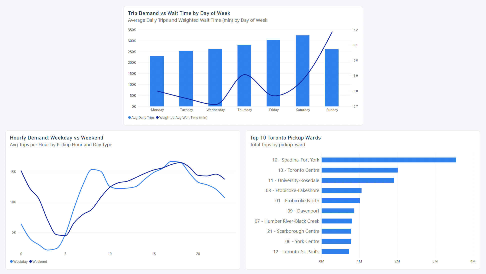
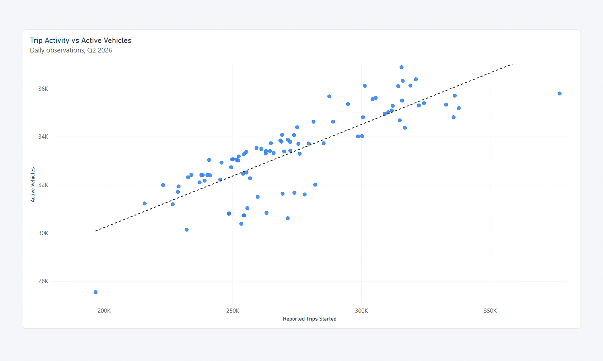
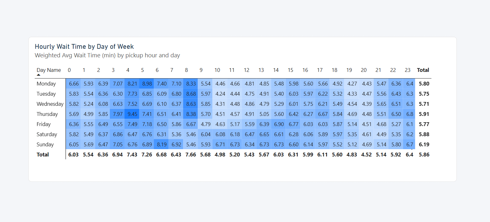
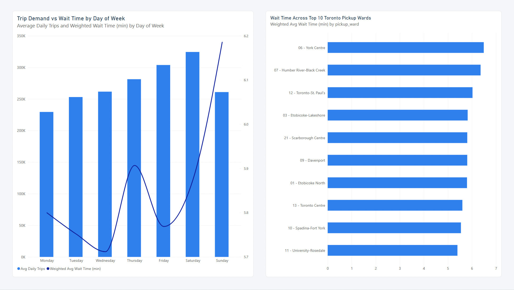
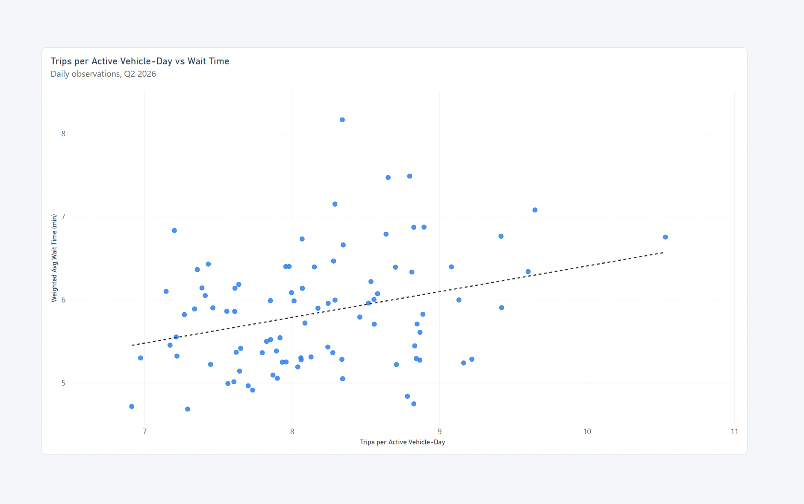

# Toronto Rideshare Operations Analysis

An operational analysis of Q2 2026 rideshare activity across the GTA, focused on trip demand, active vehicle count, passenger wait times, and trips per active vehicle-day, with Toronto-specific analysis at the pickup-ward level.

**Tools:** Power BI · Power Query · DAX · GitHub

## Key Findings

- Q2 2026 included approximately **24.9 million completed trips**, with **Saturday** showing the highest average daily trip volume at about **324,439 trips**.

- **Sunday** had the highest weighted average wait time at **6.19 minutes**. By hour, wait time was highest around **8:00 AM at 7.66 minutes** and lowest around **8:00 PM at 4.52 minutes**.

- **Spadina-Fort York** had the highest pickup volume, while **York Centre** had the highest weighted average wait time among the top 10 pickup wards at **6.49 minutes**.

- Daily **Trips per Active Vehicle-Day** and passenger wait time showed a **modest positive association (r = 0.31)**, suggesting that days with more trips per active vehicle tended to have somewhat longer waits, but this measure did not explain wait-time patterns on its own.

## Project Overview

This project looks at GTA rideshare operations during **Q2 2026**, covering **April, May, and June**.

When I first reviewed the data, I wanted to understand more than just how many trips were being completed. I was interested in how **trip demand**, **active vehicle count**, and **passenger wait time** changed together, and whether more trips per active vehicle-day were associated with longer waits.

I also wanted to see where and when rideshare activity was concentrated across the GTA, with more detailed geographic comparisons at the **City of Toronto pickup-ward level**. This led me to look at patterns by **date**, **day of week**, **pickup hour**, and **pickup ward**.

The main goal of the project was to build a clearer picture of how trip activity, active vehicle count, and service performance interacted during the quarter.

## Data Sources

This project uses publicly available rideshare data from the **City of Toronto Open Data Portal**:

- [Private Transportation Companies – Summary and Trip Data](https://open.toronto.ca/dataset/private-transportation-companies-summary-and-trip-data)

The analysis covers **April, May, and June 2026**.

The trip data includes activity across the GTA. For ward-level analysis, I filtered the visuals to City of Toronto pickup wards only.

I used two parts of the dataset:

- monthly trip data, which includes fields for date, pickup hour, pickup municipality, pickup ward, trip counts, and average wait time;
- daily summary data, which includes operational measures such as **reported trips started** and **active vehicles**.

I combined the three monthly trip files into one **Q2 2026** dataset in Power Query.

Using the trip data together with the daily summary data allowed me to compare trip activity with the daily active vehicle count during the quarter.

## Data Quality Checks

The combined trip table contained **875,220 rows** covering all **91 days of Q2 2026**.

No missing values or errors were found in the key date, location, or trip-volume fields used in the analysis, including `dt`, `pickup_hr`, `pickup_municipality`, `pickup_ward`, and `trips_total`.

The `waittime_avg` field contained **865 missing rows**. These rows represented only **948 trips**, or approximately **0.0038% of total Q2 trip volume**. I retained the records in the source table, while the weighted wait-time measure excludes rows where wait time is blank.

The daily `summary_stats` table contained **91 rows**, with no missing values or errors in `dt`, `reported_trips_started`, or `active_vehicles`.

As an additional validation check, I compared trip totals from the grouped trip data with `reported_trips_started` from the daily summary data. Across the quarter, the grouped trip data contained **24,891,477 trips**, compared with **24,891,464 reported trips started** — a difference of only **13 trips** (approximately **0.00005%**).

The monthly totals were also closely aligned, which gave me additional confidence that the two source tables were consistent despite being reported at different grains.

## Power BI Dashboard

I built the report in **Power BI** with two main dashboards:

**Operations Dashboard** — a high-level view of trip volume, wait time, active vehicles, trips per active vehicle-day, day-of-week patterns, and pickup locations.

  *Toronto rideshare operations overview for Q2 2026.*

**Operational Insights** — a deeper look at the relationship between **Trips per Active Vehicle-Day and wait time**, changes in **trip demand and active vehicles over time**, and wait-time differences across Toronto pickup wards.

*Operational view of trips per active vehicle-day, wait time, active vehicle count, and Toronto pickup wards.*

I also added **Month** and **Day Type** slicers so the results can be compared across **April, May, and June 2026** and between **weekdays and weekends**.

### Interactive Dashboard

[View the interactive Power BI dashboard.](https://app.powerbi.com/links/AK_AqI-p4K?ctid=c9d5b4dd-edc8-4fac-ae79-d4544895bf2d&pbi_source=linkShare)

## Main Analytical Question

How did **trip demand**, **active vehicle count**, **passenger wait time**, and **Trips per Active Vehicle-Day** interact across GTA rideshare operations during **Q2 2026**, with additional geographic analysis of City of Toronto pickup wards?

## Analytical Approach

Before starting the analysis, I reviewed the **City of Toronto technical documentation** to understand how the data was collected, grouped, and reported.

One important point was that the trip data does not represent individual rides. The data is already **aggregated by hour and pickup/drop-off location**. Because each row can represent a different number of trips, I used **trip volume as a weight** when calculating average wait time instead of taking a simple average of the published `waittime_avg` values.

I also noted that some Toronto trip records do not include usable ward-level detail because of the City's privacy rules. These records appear as **Not included elsewhere**.

For ward-level visuals, I used a `Ward Filter` to exclude **Not included elsewhere** while keeping those records in the overall dataset. These records represented **1,375,889 trips**, or approximately **6.01% of Toronto pickup trips**.

The documentation also notes that **trip cancellation counts dropped significantly starting in January 2026** and may have been affected by a methodological change. Since my analysis covers **Q2 2026**, I decided not to use cancellation metrics in the main analysis.

I then used **Power Query** to combine the trip files for **April, May, and June 2026** into one Q2 dataset.

I built a separate **DimDate** table and connected it to both the trip and summary data. I added fields for **month**, **day of week**, and **weekday/weekend** so I could use the same time filters across the report.

For the analysis, I created several DAX measures, including:

- **Total Trips** to measure overall trip activity;
- **Weighted Avg Wait Time** to account for the different number of trips represented by each row;
- **Average Active Vehicles** to represent the daily active vehicle count;
- **Trips per Active Vehicle-Day** as a simple vehicle activity/productivity measure rather than a time-based utilization rate;
- **Avg Daily Trips** to compare activity across days of the week;
- **Avg Trips per Hour** to compare hourly demand patterns.

I also created **Day Type** to compare hourly trip patterns between **weekdays and weekends**.

Finally, I compared daily **Trips per Active Vehicle-Day** with passenger wait time and calculated a correlation measure to see whether more trips per active vehicle-day were associated with longer waits.

## Question 1: When and where is completed rideshare activity concentrated?

### Finding

During **Q2 2026**, the data shows **24,891,477 completed trips**.

Trip activity followed a clear weekly pattern. Average daily trips generally increased toward the end of the week, with **Saturday having the highest average daily trip volume at 324,439 trips**.

The hourly pattern also showed a clear difference between weekdays and weekends. At **8:00 AM**, average hourly demand was **15,397 trips on weekdays** compared with **8,795 on weekends**.

By the late afternoon, the difference became much smaller. At **6:00 PM**, average hourly demand was **16,561 trips on weekdays** and **16,537 on weekends**.

Location also made a large difference. **Ward 10 – Spadina-Fort York** had the highest pickup volume, followed by **Ward 13 – Toronto Centre** and **Ward 11 – University-Rosedale**.

*Trip demand patterns by day, hour, and Toronto pickup ward during Q2 2026.*

### Insight

What stood out to me was how much rideshare demand changed depending on **time and location**.

Demand was stronger toward the end of the week, while weekday and weekend patterns were very different in the morning. By the evening, however, demand became much more similar.

Trip activity was also concentrated in a small group of Toronto wards, especially **Spadina-Fort York**.

### Recommendation

Recurring demand patterns should be reviewed together with active vehicle count and wait time, especially toward the end of the week and during busy afternoon and evening hours.

High-volume pickup areas such as **Spadina-Fort York**, **Toronto Centre**, and **University-Rosedale** are useful priorities for further location-level service review. More detailed vehicle-availability data would be needed before recommending specific coverage changes.

## Question 2: How does active vehicle count change with trip activity?

### Finding

Across all **91 days of Q2 2026**, daily trip activity and active vehicle count showed a clear positive relationship.

Higher-trip days generally had more active vehicles, although the relationship was not one-to-one. Days with similar trip activity could still show different active vehicle counts.

The full-quarter scatter plot supports the same pattern seen in the daily time-series view and avoids drawing conclusions from only a small number of individual dates.

*Daily reported trips started compared with active vehicle count across the 91 days of Q2 2026.*

### Insight

What stood out to me was that active vehicle count generally moved with changes in trip activity, but the relationship was not one-to-one.

On higher-demand days, the number of trips per active vehicle could still increase even when more vehicles were active.

This suggests that active vehicle count and trip activity are more useful when viewed together rather than as separate measures.

### Recommendation

Active vehicle count should be monitored together with trip activity and **Trips per Active Vehicle-Day**.

This would make it easier to identify periods when trip activity is increasing faster than the number of active vehicles, while avoiding assumptions about whether vehicle supply was sufficient without more detailed availability data.

## Question 3: When do riders experience longer wait times, and how does this vary across Toronto pickup wards?

### Finding

Wait time did not always move with trip demand.

**Sunday** had the highest weighted average wait time at **6.19 minutes**, even though average daily trip volume was **260,937 trips**.

By comparison, **Saturday** had the highest average daily trip volume at **324,439 trips**, but its weighted average wait time was lower at **5.88 minutes**.

Hourly patterns added another layer to the wait-time analysis.

Across Q2, weighted average wait time was highest around **8:00 AM at 7.66 minutes**, with other elevated periods around **4:00 AM at 7.43 minutes** and **5:00 AM at 7.26 minutes**.

By comparison, average wait time was lowest around **8:00 PM at 4.52 minutes** and **7:00 PM at 4.83 minutes**.

The highest individual day-hour combination was **Thursday at 4:00 AM**, with a weighted average wait time of **9.45 minutes**.

*Weighted average passenger wait time by pickup hour and day of week during Q2 2026.*

A similar pattern appeared across pickup wards.

Among the top 10 Toronto pickup wards, **York Centre** had the highest weighted average wait time at **6.49 minutes**.

In comparison, **Spadina-Fort York**, which had the highest pickup volume, had a lower weighted average wait time of **5.54 minutes**. **University-Rosedale** had the lowest wait time among the top 10 wards at **5.40 minutes**.

These differences are descriptive. Without an official service-level target or a measure of variability around the published averages, I cannot determine whether the observed differences are operationally significant.

*Trip demand and weighted average wait time by day of week, alongside wait-time differences across the top 10 Toronto pickup wards.*

### Insight

What stood out to me was that higher trip volume did not always mean longer passenger wait times.

Sunday had lower trip activity than Saturday but a longer average wait time. The hourly analysis also showed that wait times were generally higher during the **early morning**, particularly around **4:00–8:00 AM**, while evening wait times were lower.

The same pattern of demand not fully explaining wait time appeared across wards, where **York Centre** had the longest wait time among the top 10 pickup wards even though it was not one of the highest-volume areas.

This suggests that wait time depends on more than demand alone. Time of day, local vehicle availability, and vehicle distribution could also contribute to these patterns, although the available vehicle data cannot test availability directly by ward or hour.

### Recommendation

Wait time should be monitored together with trip volume rather than using demand alone to identify potential service issues.

The **early-morning period**, especially around **4:00–8:00 AM**, would be useful for further review because wait times were consistently higher than during the evening.

**Sunday** and **York Centre** would also be useful areas for further review because they showed relatively high wait times without having the highest trip volumes.

More detailed vehicle-availability data by **hour and location** would be needed before recommending specific changes to vehicle coverage.

## Question 4: Are more trips per active vehicle-day associated with longer passenger wait times?

### Finding

I compared daily **Trips per Active Vehicle-Day** with **Weighted Avg Wait Time** to see whether days with more trips per active vehicle were associated with longer passenger waits.

The scatter plot showed a modest upward pattern, and the correlation between the two measures was **0.31**.

This indicates a **modest positive association**: days with more trips per active vehicle tended to have somewhat longer passenger wait times.

*Daily Trips per Active Vehicle-Day compared with weighted average passenger wait time during Q2 2026.*

### Insight

What stood out to me was that higher trips per active vehicle-day were associated with somewhat longer wait times, but the relationship was not strong.

This suggests that vehicle activity is only one part of the wait-time picture.

Other factors, such as **where vehicles are available**, **time of day**, and changes in local demand could also contribute to passenger wait times.

### Recommendation

**Trips per Active Vehicle-Day** should be monitored together with passenger wait time rather than treated as a standalone performance measure.

The **0.31 correlation** shows a modest association, not causation, so more detailed analysis would be needed before using this measure to set operational targets.

## Limitations

I kept several limitations in mind while interpreting the results.

- The trip data is already **aggregated by hour and location**, so it does not represent individual rides. This means I could analyze overall patterns, but not rider-level variation.

- Some Toronto pickup records do not include usable **ward-level detail** because of the City's privacy rules. Records labelled **Not included elsewhere** represented **1,375,889 trips**, or approximately **6.01% of Toronto pickup trips**. These records were retained in the overall dataset but excluded from Toronto ward-level comparisons.

- The `waittime_avg` field contained **865 missing rows**, representing only **948 trips** or approximately **0.0038% of total Q2 trip volume**. These rows were excluded from the weighted wait-time calculation when wait time was blank.

- **Active Vehicles** is available as a daily summary measure. Because of this, I could compare daily active vehicle count with daily trip activity, but I could not measure vehicle availability directly by **ward or hour**.

- The City notes that **cancellation data from January 2026 onward may have been affected by a methodological change**. Since this project covers **Q2 2026**, I did not use cancellation metrics in the main analysis.

- The analysis covers only **three months: April through June 2026**. The patterns found here may not represent other seasons or longer-term rideshare behaviour.

- The **0.31 correlation** between Trips per Active Vehicle-Day and wait time shows an association, not causation. The correlation is unadjusted and does not control for recurring time patterns such as **day of week** or other factors that may influence passenger wait time.

## Final Recommendations

Based on the patterns I found in the data, I would focus on the following areas:

- Monitor active vehicle count alongside recurring demand patterns, particularly on higher-demand days.

- Use high-volume pickup areas such as **Spadina-Fort York**, **Toronto Centre**, and **University-Rosedale** as priorities for further location-level service review.

- Monitor **wait time together with trip volume**. Higher demand did not always lead to longer waits, so demand alone should not be used to judge service performance.

- Review **early-morning wait-time patterns**, particularly around **4:00–8:00 AM**, where average waits were consistently higher than during evening hours.

- Review areas such as **York Centre**, where wait time was relatively high even though trip volume was not among the highest.

- Track **Trips per Active Vehicle-Day** together with wait time. The **0.31 correlation** shows a modest association, but more detailed analysis would be needed before using this measure to set any operational target.

- Continue comparing **active vehicle count and trip activity** over time to see how closely vehicle activity changes with higher-demand periods.

## Conclusion

This project helped me look at GTA rideshare operations from more than one angle using **Q2 2026** data, with additional geographic analysis focused on City of Toronto pickup wards.

Instead of looking only at trip volume, I compared **demand**, **active vehicle count**, **passenger wait time**, and **Trips per Active Vehicle-Day** to understand how they changed together.

The analysis showed that demand followed clear patterns by **day, hour, and location**, while active vehicle count generally moved with changes in trip activity. Wait time also varied by time of day, with higher averages during the early morning and lower averages during the evening.

One of the more interesting findings for me was that **higher demand did not always mean longer wait times**. Some lower-volume periods and areas still had relatively high wait times.

I also found a **modest positive relationship** between **Trips per Active Vehicle-Day** and passenger wait time, with a correlation of **0.31**. More trips per active vehicle-day were associated with somewhat longer passenger wait times, but the relationship was modest and does not establish causation.

Overall, the project showed me the value of looking at several operational measures together rather than judging performance from a single metric.
